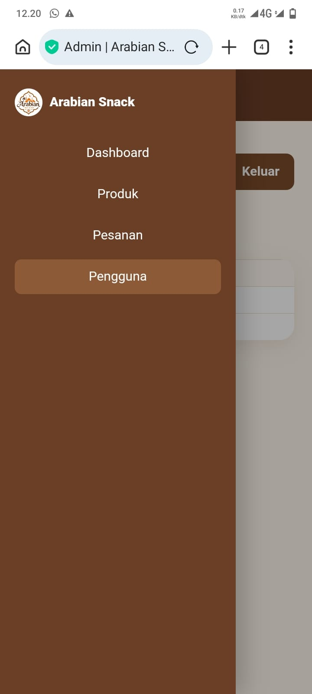
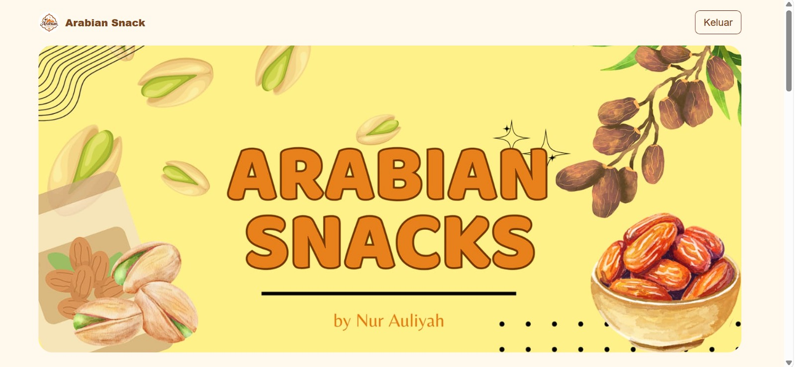
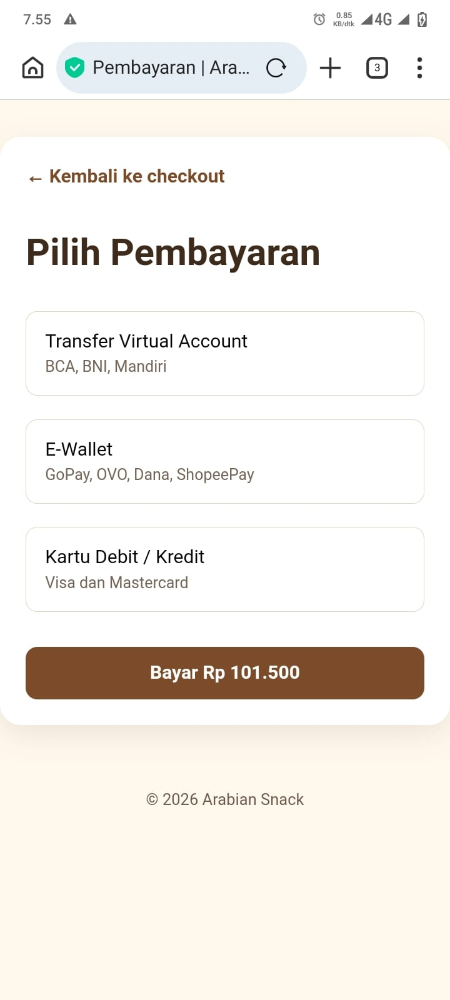
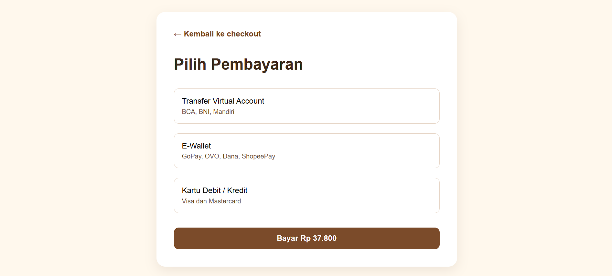
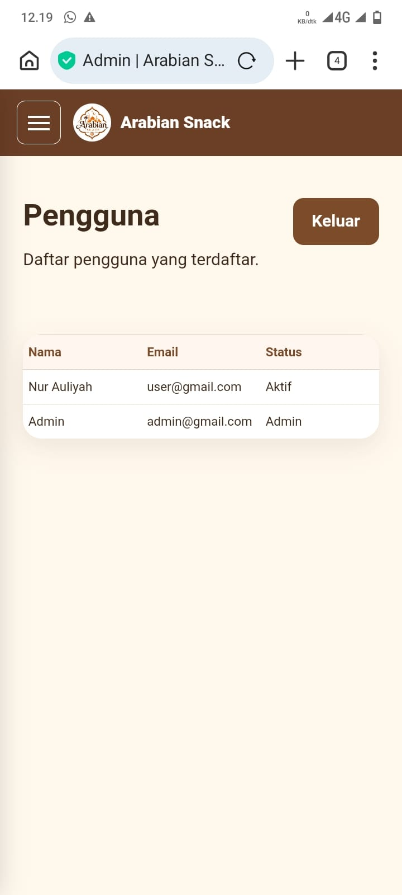
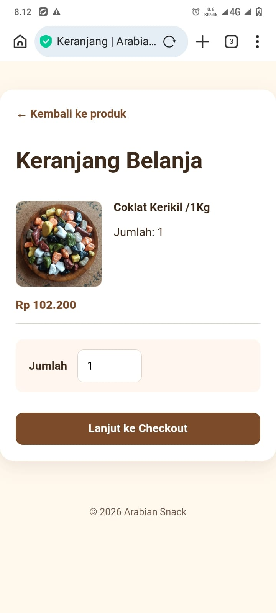
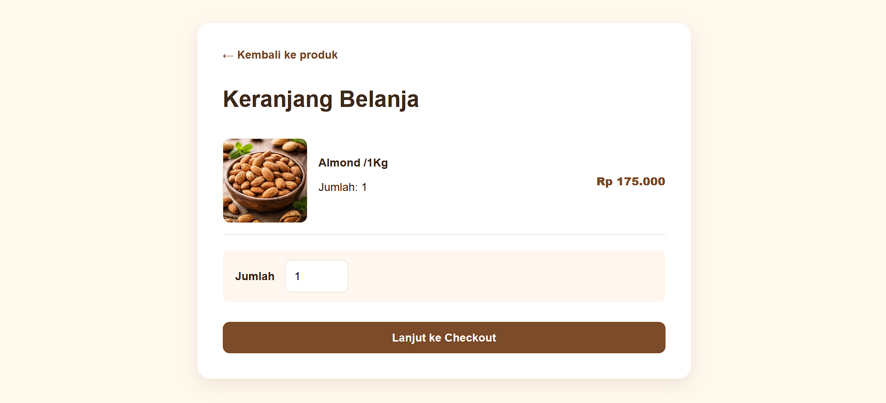

# Arabian Snack

> Prototype e-commerce untuk oleh-oleh dan camilan khas Timur Tengah.

## Informasi proyek

- Mata kuliah: E-Commerce / Pengembangan Web
- Judul proyek: **Membangun Website E-Commerce Fungsional dengan Integrasi Strategi Bisnis Modern**
- Nama bisnis: **Arabian Snack**
- Repository GitHub: **[https://github.com/migyullya-code/Arabian-Snack]**
- GitHub Pages: **[ https://migyullya-code.github.io/Arabian-Snack/]**

Arabian Snack adalah toko online yang menawarkan kurma, kacang-kacangan, coklat kerikil, air ZamZam, serta paket oleh-oleh bertema haji/umrah. Website ini dirancang untuk memberikan pengalaman belanja yang sederhana, jelas, dan nyaman di perangkat desktop maupun seluler.

## Proposisi nilai

- Produk oleh-oleh haji/umrah dan camilan pilihan dalam satu katalog.
- Paket Dus Ka'bah dan Dus Kotak dengan beberapa pilihan isi serta harga yang berbeda.
- Foto produk asli, harga yang jelas, dan alur pembelian yang mudah dipahami.
- Desain responsif dengan identitas visual Arabian Snack.

## Target pasar dan segmentasi

| Segmen | Karakteristik | Kebutuhan |
| --- | --- | --- |
| Keluarga dan individu | Pembeli oleh-oleh atau hadiah | Paket praktis, menarik, dan siap diberikan |
| Jemaah haji/umrah | Membutuhkan buah tangan | Produk bernuansa haji/umrah dengan isi bermanfaat |
| Pecinta camilan | Remaja hingga dewasa | Kurma, kacang, kismis, dan coklat berkualitas |
| Reseller skala kecil | Penjual ulang di lingkungan lokal | Produk visual menarik dan mudah dipasarkan |

## Analisis pasar dan pesaing

Tren belanja oleh-oleh secara online meningkat karena konsumen menginginkan pilihan produk, harga, dan proses pemesanan yang mudah diakses dari ponsel. Arabian Snack bersaing dengan toko oleh-oleh lokal, marketplace, dan toko kurma/kacang online. Pembeda utama bisnis ini adalah kombinasi paket bertema haji/umrah, visual produk asli, dan katalog camilan pilihan dalam satu tempat.

## Katalog dan manajemen produk

Katalog saat ini memuat paket Dus Ka'bah, Dus Kotak, Air ZamZam, Kurma, Pistachio, Kismis, Coklat Kerikil, Kacang Arab, dan Almond.

Strategi manajemen produk:

- Paket Dus Ka'bah dan Dus Kotak ditampilkan sebagai produk utama dengan pilihan paket di halaman keranjang.
- Camilan satuan dapat langsung dimasukkan ke keranjang.
- Foto produk disimpan secara lokal pada folder `images/` agar tampilan lebih konsisten.
- Harga paket Dus dibedakan berdasarkan isi paketnya.

## Model bisnis dan pendapatan

Model bisnis yang digunakan adalah **Business to Consumer (B2C)**. Pendapatan utama berasal dari penjualan produk satuan dan paket oleh-oleh. Peluang pendapatan tambahan dapat berasal dari pesanan paket acara, hampers musiman, dan kerja sama reseller.

## Strategi harga, promosi, dan diskon

- Harga produk disesuaikan dengan jenis isi, kemasan, dan nilai paket.
- Paket hemat menjadi pilihan untuk pembelian dengan anggaran terbatas.
- Promosi dapat dilakukan melalui Instagram `@arabiansnack_`, WhatsApp, serta diskon bundling pada momen Ramadan, Idulfitri, dan musim haji/umrah.
- Rekomendasi program loyalitas: diskon untuk pembelian ulang dan kode promo bagi pelanggan baru.

## Fitur website

- Login demo untuk pengguna dan admin.
- Katalog produk responsif dengan foto, nama, harga, dan tombol tambah ke keranjang.
- Pilihan paket Dus Ka'bah dan Dus Kotak dengan foto serta harga berbeda.
- Keranjang dengan pilihan jumlah produk.
- Checkout dengan formulir alamat pengiriman.
- Simulasi pemilihan metode pembayaran dan halaman pembayaran berhasil.
- Penyimpanan produk terpilih menggunakan `localStorage`.
- Dashboard admin sederhana.
- Banner, footer, dan kontak Instagram/WhatsApp.

### Akun demo

| Peran | Email | Password |
| --- | --- | --- |
| Pengguna | `user@gmail.com` | `user123` |
| Admin | `admin@gmail.com` | `admin123` |

## Alur checkout dan simulasi payment gateway

1. Pengguna memilih produk dari katalog.
2. Produk masuk ke keranjang; paket Dus dapat dipilih sesuai variasi paketnya.
3. Pengguna mengisi alamat pada halaman checkout.
4. Pengguna memilih metode pembayaran: Virtual Account, E-Wallet, atau kartu debit/kredit.
5. Sistem menampilkan halaman pembayaran berhasil sebagai simulasi payment gateway.

Integrasi pembayaran yang direncanakan untuk pengembangan berikutnya adalah **Midtrans Sandbox** atau **Xendit Sandbox**, sehingga transaksi dapat diuji tanpa pembayaran nyata.

## Teknologi dan struktur proyek

Website dibangun menggunakan HTML5, CSS3, dan JavaScript vanilla (ES6+) tanpa framework. CSS menggunakan Flexbox, CSS Grid, serta media query untuk tampilan responsif.

```text
Nur/
├── index.html       # Beranda dan katalog
├── login.html       # Login pengguna/admin
├── admin.html       # Dashboard admin
├── cart.html        # Keranjang dan pilihan paket
├── checkout.html    # Form checkout
├── payment.html     # Simulasi pembayaran
├── success.html     # Konfirmasi pembayaran
├── css/
│   └── style.css
├── js/
│   └── app.js
└── images/          # Banner, logo, dan foto produk
```

## Responsivitas dan UX

Tampilan menggunakan grid produk yang menyesuaikan ukuran layar, kartu produk dengan foto persegi, navigasi sederhana, tombol berukuran nyaman disentuh, dan footer yang berubah menjadi susunan vertikal pada layar kecil.

## SEO, keamanan, dan pemeliharaan

- **SEO:** gunakan judul halaman yang spesifik, deskripsi meta, `alt` pada gambar, dan kata kunci seperti “oleh-oleh haji”, “kurma”, serta “paket Dus Ka'bah”.
- **Keamanan:** validasi input di sisi klien merupakan langkah dasar; pada implementasi produksi, autentikasi, data pelanggan, dan pembayaran harus diproses melalui server aman (HTTPS).
- **Pemeliharaan:** perbarui stok, harga, foto, katalog, dan informasi promo secara berkala. Lakukan pengujian di desktop dan perangkat seluler sebelum publikasi.

## Rencana analitik web

Website dapat diintegrasikan dengan Google Analytics 4 menggunakan kode pengukuran dummy selama tahap pengembangan, kemudian diganti dengan Measurement ID asli saat publikasi.

Metrik yang akan dipantau:

- Jumlah pengunjung dan sumber trafik.
- Halaman atau produk yang paling sering dilihat.
- Rasio *bounce* dan durasi kunjungan.
- Jumlah klik tombol “Tambah ke Keranjang”.
- Rasio konversi dari katalog ke checkout dan pembayaran berhasil.

Data tersebut digunakan untuk menentukan produk unggulan, mengevaluasi kampanye Instagram/WhatsApp, dan memperbaiki proses belanja yang belum efektif.

## Pengembangan lanjutan

- Pencarian dan filter produk berdasarkan nama, kategori, dan harga.
- Keranjang multi-item dengan ubah jumlah, hapus item, serta total otomatis.
- Validasi checkout yang lebih lengkap.
- Integrasi payment gateway sandbox.
- Dashboard admin untuk pengelolaan stok dan pesanan.
- Integrasi Google Analytics 4 dan SEO metadata.

## Screenshot Website

Dokumentasi tampilandikelompokkan berdasarkan perangkat dan jenis akses.

## Dokumentasi Tampilan

| Tampilan awal | Tampilan awal |
| --- | --- |
|  |  |  |

| Beranda | Katalog Produk |
| --- | --- |
|  |  |
|  |  |

| Checkout | Dashboard Admin |
| --- | --- |
|  |  |
|  |  |

| Metode Pembayaran | Produk Admin |
| --- | --- |
|  |  |
|  |  |

| Pesanan Admin | Pengguna Admin |
| --- | --- |
|  |  |
|  |  |

| Pembayaran Sukses | Keranjang |
| --- | --- |
|  |  |
|  |  |

| Paket 1 | Paket 2 |
| --- | --- |
|  |  |
|  |  |

## Kontak bisnis

- Instagram: [@arabiansnack_](https://www.instagram.com/arabiansnack_)
- WhatsApp: [085864909093](https://wa.me/6285864909093)
